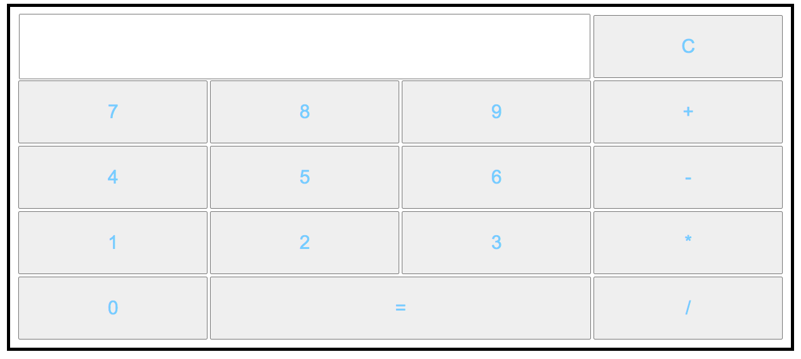

# Calculator

this exercise was intended as its name suggests
to create a calculator.

like the previous exercises, I first made an html css version only to have an overview. This allows me to produce the JS version much more easily.

the calculator is also responsive

